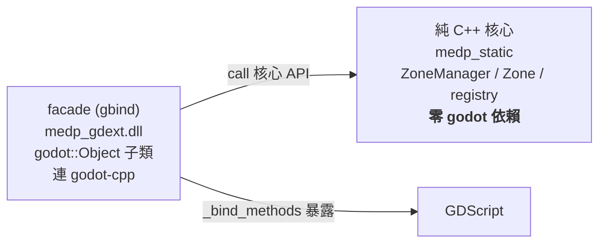

# Godot 4 GDExtension 接入教學:架構與建置（medps 版）

> 本篇是 [godot_gdextension_setup.md](godot_gdextension_setup.md) 的子篇,說明核心/facade 分層原則、godot-cpp 怎麼接進 CMake、以及 build 流程。
> 已驗證環境:godot-cpp(target **Godot 4.6**)、C++20 / MSVC。

---

## 0. 架構原則:核心零 godot,facade 只是薄殼



- **核心**(`medp` / `medp_static`)**永遠不** `#include` godot-cpp。可獨立編譯、獨立測試(`medp_test.exe`)。
- **facade**(`projects/medp/src/gbind/`)是唯一能 include godot-cpp 的地方,繼承 `godot::Object`/`RefCounted`/`Node`,呼叫核心 API,用 `_bind_methods` 暴露給 GDScript。
- CMake 用 `list(FILTER src EXCLUDE REGEX "/gbind/")` 把 gbind 排除在核心 target 外,從建置層面保證核心不沾 godot。

> 為何 facade 必須是薄殼:`godot::Object` 子類的記憶體配置走 Godot 引擎(`memnew`/`memdelete`),必須活在 Godot 進程內。所以模擬邏輯留在核心,facade 只做轉接。

---

## 1. godot-cpp 怎麼接進來

採 **add_subdirectory 指向外部 checkout**(不 vendoring 進 repo,因為 godot-cpp build 時會生成 2000+ 檔案):

```cmake
# CMakeLists.txt — 預設 OFF,因為 godot-cpp 第一次 build 很慢
option(MEDP_BUILD_GDEXTENSION "Build the Godot 4 GDExtension facade (projects/medp/src/gbind)" OFF)
if(MEDP_BUILD_GDEXTENSION)
    set(GODOT_CPP_DIR "C:/code/mine/pas/projects/godot-cpp"
        CACHE PATH "Path to the godot-cpp checkout")
    add_subdirectory("${GODOT_CPP_DIR}" "${CMAKE_BINARY_DIR}/godot-cpp-build")

    file(GLOB_RECURSE gbind_src "${SRC}/gbind/*.cpp" "${SRC}/gbind/*.h")
    add_library(medp_gdext SHARED ${gbind_src})
    set_target_properties(medp_gdext PROPERTIES CXX_STANDARD 20 OUTPUT_NAME "medp_gdext")
    target_include_directories(medp_gdext PRIVATE "${SRC}")
    target_link_libraries(medp_gdext PRIVATE "${PROJ}_static" godot-cpp)
endif()
```

重點:
- godot-cpp 的 CMake target 叫 **`godot-cpp`**(static lib)。`target_link_libraries(... godot-cpp)` 會自動帶上它的 include 路徑(含 build 時生成的 `gen/include/`)。
- bindings **不在源碼樹**,是 configure/build 時由 `binding_generator.py` 生成到 `projects/medp/build/godot-cpp-build/gen/`。
- 換機器時改 `GODOT_CPP_DIR`(路徑寫死,這是已知的不可攜代價;要可攜就改 submodule)。

---

## 2. build 流程

```bash
# 開啟 option 重新 configure(godot-cpp 在這步生成 bindings,約一兩分鐘)
cmake -S . -B build -DMEDP_BUILD_GDEXTENSION=ON

# 編譯 facade(第一次會連 godot-cpp 整包一起編,很久;之後增量很快)
cmake --build build --target medp_gdext
```

產出:`projects/medp/build/bin/medp_gdext.dll`。

> 平常開發**不要**開這個 option——核心(`medp_test` 等)的 build 不需要 godot-cpp,開了只會拖慢。只在要更新 GDExtension 時才開。

---

下一篇:[gbind 開發與除錯實務](godot_gdextension_setup_gbind.md)　|　回[目錄](godot_gdextension_setup.md)
