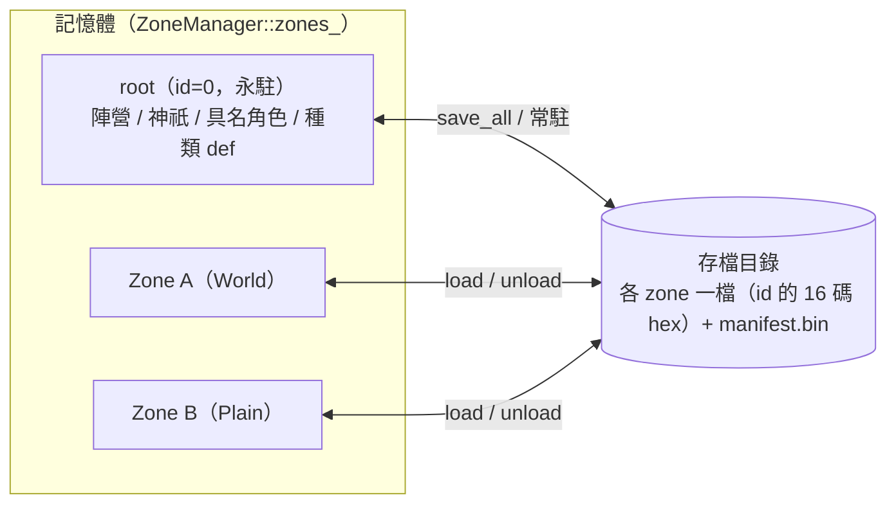

# Zone / Registry 架構教學

> 本文回答「**為什麼**是這個架構」，不是逐檔地圖、不是線性導讀、也不是操作步驟——那三份見下。
> 對應程式碼：`projects/medp/src/gcore/zone/`、`projects/medp/src/gcore/serialize/`、
> `projects/medp/src/gcore/common/`。

## 這份文件跟其他三份怎麼分工

| 文件 | 回答什麼 | 不重複的邊界 |
|---|---|---|
| 本文 | 為什麼是這個架構——動機、取捨、代價 | 不列檔案清單、不逐行導讀、不寫操作步驟 |
| [gcore_overview.md](../work/architecture/gcore_overview.md) | 每個檔案做什麼、彼此怎麼接 | 逐檔地圖，本文不重複檔案清單 |
| [CODE_TOUR.md](../../workflows/common/code-map/CODE_TOUR.md) | 照順序讀原始碼的路徑 | 帶行號的閱讀站點，本文不重複站點內容 |
| [how_to_add_component_and_system.md](how_to_add_component_and_system.md) | 新增 component/system 的實際步驟 | 操作 SOP，本文只講「為什麼這樣設計」 |

想知道某個檔案在哪、怎麼讀、怎麼動手，去上面三份；想知道「這個設計是為了解決什麼問題」，留在本文與兩份子文件。

## 0. 核心概念一句話

世界被切成多個 **zone**，每個 zone 自帶一個獨立的 `entt::registry`（實體）＋自己的多層
tile 地圖（`layers`）。`ZoneManager` 持有目前記憶體中的所有 zone、對它們跑 system、
負責存讀磁碟。root（id 固定為 0）永久存活、放非地圖的全局實體；其餘 zone 按需
`load()`/`unload()`。

## 1. 為什麼一 zone 一 registry

把整個世界塞進一個 `entt::registry` 沒問題，但 zone 是本專案的記憶體單位也是存檔單位：
玩家在哪、遊戲就該把哪塊地圖＋entity 留在記憶體，其餘寫回磁碟。用「一 zone 一
registry」把這兩件事天然綁在一起——`unload` 一個 zone 就是序列化那個 registry 再釋放它，
不需要在單一巨大 registry 裡篩選「哪些 entity 屬於這個區域」。

代價是跨 zone 的引用不能再用 `entt::entity`、而且地圖本身（`Zone::layers`）刻意不走
ECS——它是 zone 的固有結構，不是某個 entity 的屬性，於是 registry 的 snapshot 天然碰
不到它，存檔要分兩塊處理（`zone_io`）。這兩點的細節見
[定址與身分篇](zone_streaming_architecture_addressing.md)。

## 2. 定址與身分（詳見子文件）

zone id 是裸 `uint64_t` 單調序號、零座標語意，parent 是 `Zone` 上的顯式欄位——這是
相對舊架構最大的翻轉：舊路數把型別/座標打包進一個 key、用整除回推 parent，代價是
改一個尺度就要重編全部 id。身分（id/parent/kind）直接掛在 `Zone` struct 上，不靠
registry 裡的 placeholder entity 攜帶，因此不必保證「registry 裡永遠有活著的
entity」。跨 registry 的引用（zone 之間、actor 的陣營/種類）一律存穩定的
`uint64_t` id，不存 `entt::entity`——因為 `entt::entity` 離開建立它的 registry
就沒有意義。

完整推演、程式碼引用、對照表見
**[zone_streaming_architecture_addressing.md](zone_streaming_architecture_addressing.md)**。

## 3. streaming 與序列化契約（詳見子文件）

`ZoneManager` 用 `unordered_map<ZoneId, unique_ptr<Zone>>` 持有 zone，因為對外發出的
`Zone*`/`Zone&` 位址必須在 `unordered_map` rehash 之後仍然穩定。存檔目錄是「單槽活
儲存」：目錄即世界的權威狀態，`unload` 隨時寫檔、`save_all` 是檢查點而非槽位快照，
各 zone 可能凍結於不同遊戲時刻——這是刻意接受的語意。開檔走 fail-fast 協定，寧可
throw 也不猜。兩條硬約定：`Zone*`/`Zone&` 不得跨 tick 持有；system 內禁止 zone
結構性變更（tick 重入禁令）。

序列化這邊：`AllComponents` 是唯一登記清單，漏登記會讓存檔默默漏掉該 component；
`loader.orphans()` 會清掉沒有任何已登記 component 的 entity；存檔**沒有版本欄位**，
格式一變舊檔就是壞資料且不一定顯式報錯。

完整推演、程式碼引用、時序圖見
**[zone_streaming_architecture_lifecycle.md](zone_streaming_architecture_lifecycle.md)**。

## 4. 現況與目前不做什麼

測試基準 **21 項全綠**；`World : Zone`（`projects/medp/src/gcore/world/world.h:8`）是
目前唯一子類；`projects/game/` 是第一個真實 consumer。

以下設計刻意 **defer**、且尚未凍結：目錄分桶、persistence 兩態
（Ephemeral/Persistent）、LRU 卸載（含「清掉很久沒訪問且不重要的 zone `.bin`」這類
需求）、parent→children 連結、跨 zone 實體引用機制、返回座標、Portal。看到這些概念
在教學裡沒有著墨不是遺漏，是還沒設計。

## 參考

- 定址與身分深入：[zone_streaming_architecture_addressing.md](zone_streaming_architecture_addressing.md)
- streaming 生命週期與序列化契約深入：[zone_streaming_architecture_lifecycle.md](zone_streaming_architecture_lifecycle.md)
- 逐檔地圖：[gcore_overview.md](../work/architecture/gcore_overview.md)、
  [gcore_overview_zone_serialize.md](../work/architecture/gcore_overview_zone_serialize.md)
- 線性導讀：[CODE_TOUR.md](../../workflows/common/code-map/CODE_TOUR.md)
- 新增 component/system 操作步驟：[how_to_add_component_and_system.md](how_to_add_component_and_system.md)
- EnTT / cereal 基礎教學：[entt_tutorial.md](entt_tutorial.md)、[cereal_tutorial.md](cereal_tutorial.md)
- 原始碼：`projects/medp/src/gcore/zone/zone.h`、`zone_manager.h`/`.cpp`、
  `projects/medp/src/gcore/serialize/`、`projects/medp/src/gcore/common/`
- 測試：`projects/tests/src/main.cpp`
