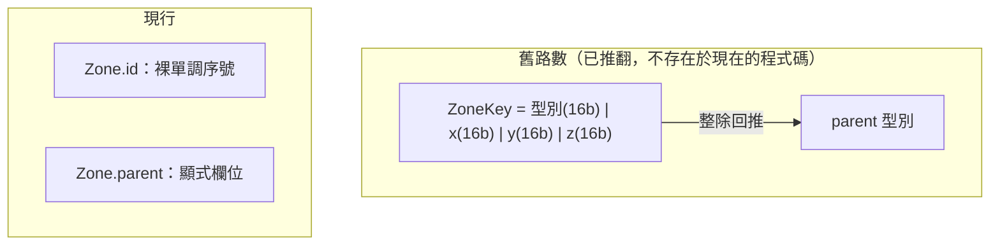

# Zone / Registry 架構教學 —— 定址與身分

> 子文件之一，回母檔見 [zone_streaming_architecture.md](zone_streaming_architecture.md)。
> 對應程式碼：`projects/medp/src/gcore/zone/zone.h`、`zone_manager.h`、
> `projects/medp/src/gcore/common/`。

## 定址：裸序號 + 顯式 parent，而不是封裝座標的 key

**這是理解本架構最值得花時間的一個轉向**：zone id 是裸 `uint64_t` 單調序號，
**零座標語意**，由 `ZoneManager::create_child`
（`projects/medp/src/gcore/zone/zone_manager.h:43`）單點配發、永不復用；parent 是
`Zone` 上的顯式欄位（`projects/medp/src/gcore/zone/zone.h:33`），**不是**從 id 算出來的。

另一條路是把型別/座標打包進一個 key（例如 16 bit 存 x、16 bit 存 y、16 bit 存層級
型別），再用整除或位移回推 parent。這條路的好處是省一個欄位；壞處是 id 一旦帶了語意
就綁死了世界的尺度與層級結構——想改一個維度的大小（例如把地圖從 200×200 改成
500×500），等於要重新計算全部既有 id，所有存檔隨之作廢。改成「id 只是純序號、parent
另外顯式存」之後，id 只回答「這是誰」，層級關係是一份獨立、可變的資料，兩者互不牽連：
改地圖尺度不影響任何既有 id。

垂直層同理：已拍板收進 `Zone::layers`（`zone.h:44`，鍵即 z），**不**進 zone id——多層
地圖是同一個 zone 的內部結構，不是彼此獨立的 zone，沒有理由讓它們各自佔一個 id。

## 身分掛在 struct 上，不靠 registry 裡的 placeholder entity

`Zone{ id, parent, reg, layers }`（`zone.h:28-44`）把身分直接放在 C++ struct 上，而不是
靠 registry 內部「一個帶特定 component 的 entity」來攜帶（這是本專案已移除的舊做法，
`zone.h:21-23` 的註解直接點名對比）。

這件事值得單獨拿出來講，是因為它排除了一整類麻煩：如果身分要靠 placeholder entity
攜帶，就必須想辦法保證那個 entity 永遠活著——序列化的 orphan 清理
（見 [lifecycle 篇](zone_streaming_architecture_lifecycle.md) 的 `loader.orphans()`）、
entity 被誤刪、空 zone 沒有其他 entity 可掛……任何一個環節出錯，zone 都可能忘記自己
是誰。把身分提升成 struct 的欄位後，這整類「怎麼保證 placeholder 存活」的問題不存在：
zone 有沒有 entity、registry 是空是滿，跟它知不知道自己的 `id`/`parent` 完全無關。

代價對稱地在別處付：身分數據不再享有 component 的通用機制（不能用 entt 的 view
查詢「所有 zone」），但 zone 本來就是由 `ZoneManager` 集中持有於
`unordered_map<ZoneId, unique_ptr<Zone>>`（`zone_manager.h:93`），不需要那套機制——
`ZoneManager` 自己就是那份索引。

`Zone` 同時是繼承基底（virtual dtor，`zone.h:46`；`World` 是目前唯一子類，
`world/world.h:8`），身分欄位（id/parent/kind）與地圖（layers）住在基底、由所有子類
共用；子類只加自己專屬的資料（例如 `World::gen`），經 `save_extra`/`load_extra`
（`zone.h:55-56`）掛進序列化。

## 跨 registry 引用：為什麼不能用 `entt::entity`

`entt::entity` 只在建立它的那個 registry 內有效——底層是該 registry 內部的索引/版本
編碼，脫離原 registry 沒有意義，不能拿到另一個 registry 裡查。medps 是一 zone 一
registry（動機見母檔 §1），所以任何跨 zone、或跨「某 zone 與 root」的引用，一律改存
**穩定的 `uint64_t` id**，不把 `entt::entity` 存進另一個 component 裡：

| 引用什麼 | 存什麼 | 位置 |
|---|---|---|
| zone 之間互指 | `ZoneManager::ZoneId` | `zone_manager.h:23` |
| actor 的陣營歸屬 | `Owner.faction` | `common/components/owner.h:9` |
| actor 的地點種類 | `Location.kind` | `common/components/location.h:24` |
| actor 的部隊種類 | `Unit.kind` | `common/components/unit.h:22` |

種類定義（`LocationKind`/`UnitKind`，各自的 def 實體）住在 root
（`common/actor.h:26-55`），actor 以穩定 id 參照它，不直接持有 def 的 entity handle——
即使 actor 與它引用的 def 剛好都在記憶體裡，也不能圖方便存 `entt::entity`，因為這條
引用要能在存檔／跨 zone 的情境下仍然成立。

這個模式（穩定 id 而非 entity handle）在 zone id、faction id、kind id 上重複出現，
不是巧合，是同一條規則的三個實例：**任何可能跨 registry 存活的引用，一律用零語意的
穩定 id，不用 `entt::entity`**。相關檔案：`common/actor.h`、
`common/components/{name,owner,location,unit}.h`。

## 參考

- 回母檔：[zone_streaming_architecture.md](zone_streaming_architecture.md)
- streaming 生命週期與序列化契約：[zone_streaming_architecture_lifecycle.md](zone_streaming_architecture_lifecycle.md)
- actor 身分層逐檔說明：[gcore_overview_world_common.md](../work/architecture/gcore_overview_world_common.md)
