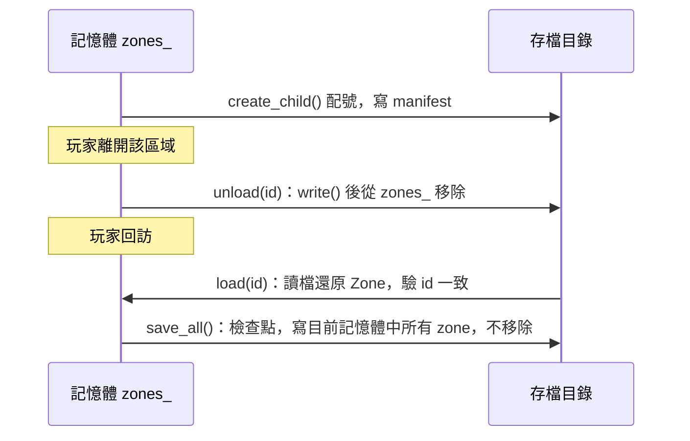

# Zone / Registry 架構教學 —— streaming 生命週期與序列化契約

> 子文件之一，回母檔見 [zone_streaming_architecture.md](zone_streaming_architecture.md)。
> 對應程式碼：`projects/medp/src/gcore/zone/zone_manager.h`/`.cpp`、
> `projects/medp/src/gcore/serialize/`。

## ZoneManager 怎麼想 load / unload

`ZoneManager` 用 `unordered_map<ZoneId, unique_ptr<Zone>>`（`zone_manager.h:93`）而非
直接存 `Zone` 值——因為 `unordered_map` rehash 會搬動內部元素，而
`get()`/`create_child()`/`root()`（`zone_manager.h:34,37,43`）對外發出的是
`Zone*`/`Zone&`，這些位址必須在 rehash 之後仍然有效。`unique_ptr` 給的是穩定的堆
位址，rehash 只搬動指標本身，指標指向的 `Zone` 物件位址不變。

存檔目錄的語意是**「單槽活儲存」**（`zone_manager.h:14-17` 註解）：目錄本身就是世界的
權威狀態，`unload()`（`zone_manager.cpp:113-119`）隨時把該 zone 寫回磁碟並移出記憶體，
`save_all()`（`zone_manager.cpp:91-95`）只是「把目前記憶體中所有 zone（含 root）都寫
一遍」的檢查點，不是槽位快照——各 zone 完全可能凍結在不同的遊戲時刻（有的剛
unload、有的還在跑到一半）。這是**刻意接受**的語意，不是 bug：要多槽存檔或另存新檔，
做法是複製整個目錄，不是在單一目錄裡維護版本歷史。

開檔走 fail-fast 協定，寧可 throw 也不猜（建構子 `zone_manager.cpp:9-30`）：

1. `manifest.bin` 存在 → 還原 `next_id_`，並**必須**成功載入 `root.bin`；缺失視為存檔
   損毀，throw。
2. `manifest.bin` 不存在但目錄裡已有 `.bin` 檔 → throw（不會被誤當新世界、靜默覆寫
   舊檔）。
3. 目錄乾淨 → 視為全新世界，建構一個沒有地圖的 root。

配號與載入也各自守一條 fail-fast 規則：`create_child()` 配到的 id 若在磁碟上已有檔案
（manifest 損毀/回退的徵兆）→ throw，不靜默覆寫（`zone_manager.cpp:53-56`）；
`load()` 若檔案內容的 id 與請求的 id 不符 → throw（`zone_manager.cpp:105-108`）；
`destroy()` 連磁碟上的檔案一起刪，避免死 zone 之後被 `load()` 靜默復活
（`zone_manager.cpp:60-64`）。

兩條寫進 header 註解的硬約定：

- **指標生存期**：`get()`/`create_child()`/`root()` 給出的 `Zone*`/`Zone&` 不得跨 tick
  持有——想長駐就存 `ZoneId`，每次重新 `get()`（`zone_manager.h:19-20`）。這條與上面
  「用 `unique_ptr` 保位址穩定」互補：位址在單一 tick 內穩定，不代表跨 tick 該 zone
  一定還在記憶體中（可能被別的邏輯 `unload()` 了）。
- **tick 重入禁令**：system 內禁止 zone 結構性變更（`create_child`/`load`/`unload`/
  `destroy`），因為 `tick()`（`zone_manager.cpp:125-129`）正在迭代 `zones_`，這樣做是
  迭代器 UB；將來真的需要在 system 內造/載 zone 時，計畫是改成命令緩衝（排隊、tick
  尾端執行）（`zone_manager.h:79-81`）。

system 簽章是 `using ZoneSystem = std::function<void(Zone&)>`（`zone_manager.h:72`），
吃 `Zone&` 而非 `entt::registry&`——因為 system 可能需要地圖（`Zone::layers`）而不只是
entity。`tick()` 對每個已載入的 zone（**含 root**）依註冊順序執行所有已註冊的
system。新增 system 的實際步驟見
[how_to_add_component_and_system.md](how_to_add_component_and_system.md)。

## 序列化契約與代價

`AllComponents`（`projects/medp/src/gcore/serialize/all_components.h:12-21`）是
save/load 兩邊共用的**唯一登記清單**；漏登記一個 component，存檔會**默默**漏掉它，
沒有編譯期或執行期警告——這條規則在 `AGENTS.md` 已列為鐵律，這裡補「為什麼會這樣」：
`registry_io::detail::save_impl`/`load_impl`（`registry_io.h:16,23`）用 fold
expression 展開 `AllComponents` 逐型別存取，沒登記的型別在展開時根本不存在於這個
`type_list` 裡，不是漏存某個欄位，是整個型別從未被觸碰。

更進一步，`loader.orphans()`（`registry_io.h:30`）會刪掉載入後**沒有任何已登記**
component 的 entity——只帶未登記 component 的 entity 不只資料消失，entity 本身也會
不見。這是最容易踩的坑：新增 component 忘了登記，不會編譯錯、不會執行期報錯，只會在
下一次存讀之後發現資料不見了。

`Zone` 本身的存檔分兩塊走不同的路（`zone_io.h:10-22`）：第一塊
（kind tag／id／parent／layers／子類 `save_extra`）是純資料，直接交給 cereal；第二塊
（`reg`）得走 EnTT snapshot（`registry_io`）。兩塊依序接在同一個 stream 裡，第一塊用
大括號限制 archive 生存期（`zone_io.h:26-31`）——因為 cereal 的 archive 是在解構時
才把緩衝真正寫出去，必須確保第一塊先完整落地，`registry_io` 才能接著往同一個 stream
寫第二塊。`load()`（`zone_io.h:35-47`）因此是「先讀 kind tag、經 `make_zone` 建構
對應子類、再讀入」一體完成，回傳 `unique_ptr<Zone>`；未知的 kind tag 由 `make_zone`
throw，不會靜默退回 `Plain`。

存檔**沒有版本欄位**（使用者裁定）：格式一變（新增 component、新增 `ZoneKind` 子類、
調整欄位順序……），舊 `.bin` 讀出來就是壞資料，而且**不一定會顯式報錯**——可能讀出
垃圾值而不是拋例外。重寫期間格式變動頻繁，遇到反常結果先確認是不是讀了舊格式的存檔
目錄，必要時直接刪掉重建，不要假設「能讀進來就代表格式沒變」。

## 參考

- 回母檔：[zone_streaming_architecture.md](zone_streaming_architecture.md)
- 定址與身分：[zone_streaming_architecture_addressing.md](zone_streaming_architecture_addressing.md)
- 新增 component/system 操作步驟：[how_to_add_component_and_system.md](how_to_add_component_and_system.md)
- zone/serialize 逐檔說明：[gcore_overview_zone_serialize.md](../work/architecture/gcore_overview_zone_serialize.md)
