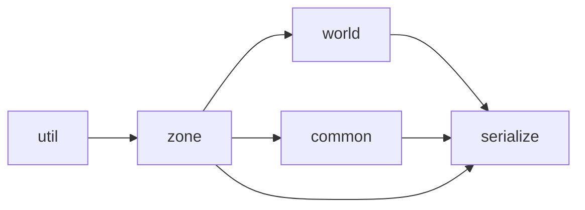

# gcore 逐檔導覽

> 對象：`projects/medp/src/gcore/`（遊戲核心框架，EnTT + cereal）。最後更新：2026-08-12。
> 測試基準：**21 項全綠**（15 zone/serialize 核心＋4 World 子類＋2 actor）。
> 這一期（Zone 子類化／目錄三分／actor 層／`projects/game/`）的**沿革**見
> [world_actor_game.md](world_actor_game.md)；本檔是**目前長怎樣**的逐檔地圖，兩者互補、不重複。
> 線性導讀（含帶行號的閱讀順序）另見 [CODE_TOUR](../../../workflows/common/code-map/CODE_TOUR.md)。

## 全域心智模型

`Zone` 是繼承基底：一個 zone = 自己的 `entt::registry`（實體）＋自己的多層 tile 地圖
（`layers`）＋身分（`id`/`parent`/`kind`）。`World` 是第一個子類（世界層地圖＋worldgen）。
`ZoneManager` 持有永駐的 root（id=0，放全局實體與 def）與所有已載入 zone，負責配號、tick、存讀檔。
actor（地點／部隊）不是 C++ 子類，是 **ECS 組合**：身分（`Name`＋`Owner`）＋家族
（`Location`或`Unit`）疊在任一 zone 的 registry 上，種類（kind）是住在 root 的資料驅動 def。

## 目錄佈局與分層邏輯

```
gcore/
  util/        無依賴工具（tdarray、metaprogramming 巨集）
  zone/        通用框架——不認識任何具體遊戲概念
  world/       第一個 Zone 子類 World 的專屬物（worldgen、position/velocity、movement）
  common/      跨 zone 共用的 actor 身分層（name/owner/location/unit＋工廠函式）
  serialize/   存讀檔（唯一登記清單 + registry snapshot + Zone 兩塊接合）
```

`gbind/`（Godot GDExtension 綁定）是 `projects/medp/src/` 下與 `gcore/` **平行**的目錄，
不在 `gcore/` 之下，本檔不涵蓋。

## 依賴方向



`world/` 與 `common/` 互不依賴（各自只依賴 `zone/`）；兩者都被 `serialize/all_components.h`
引用以登記各自的 component。`world_gen.{h,cpp}` 是純函式，不認識 `World` 型別——依賴方向
是 `World::generate()` 依賴 `world_gen`，反過來不成立。

## 分層導覽（詳情連結）

- **[zone/ ＋ serialize/](gcore_overview_zone_serialize.md)** —— Zone 基底、ZoneKind／
  make_zone／zone_cast、ZoneManager 生命週期與存讀檔協定、component 登記與 snapshot 機制。
- **[world/ ＋ common/](gcore_overview_world_common.md)** —— World 子類、libtcod worldgen、
  movement system；actor 身分層與資料驅動 def 工廠。

## util/（無依賴工具，不另立子文件）

- `tdarray.hpp`：泛型 2D 稠密陣列（`std::vector<T>` 打平，索引 `x*sy+y`），已 cereal 化，
  是 `Zone::layers` 等格網的底層容器（`projects/medp/src/gcore/util/tdarray.hpp:31,51,57`）。
  回傳 bool 的操作一律「true=失敗/越界」（`tdarray.hpp:16-17` 註解）。
- `mydef.h`：metaprogramming 巨集（`LET_CONCEPT_BE_CHECKABLE_V` 等），供 `tdarray.hpp` 的
  `is_coor` concept 使用（`projects/medp/src/gcore/util/mydef.h:56-59`）。

## 速查表

| 目錄/檔案 | 角色 | 詳情 |
|---|---|---|
| `zone/zone.h`、`zone_manager.h/.cpp` | Zone 基底＋生命週期管理 | [zone+serialize](gcore_overview_zone_serialize.md) |
| `serialize/*.h` | component 登記＋存讀檔 | [zone+serialize](gcore_overview_zone_serialize.md) |
| `world/world.h/.cpp`、`world_gen.h/.cpp` | World 子類＋worldgen | [world+common](gcore_overview_world_common.md) |
| `world/components/*`、`world/systems/movement.h` | World 專屬 component/system | [world+common](gcore_overview_world_common.md) |
| `common/actor.h`、`common/components/*` | actor 身分層＋資料驅動 def | [world+common](gcore_overview_world_common.md) |
| `util/tdarray.hpp` | 泛型 2D 稠密陣列 | 見上 |
| `util/mydef.h` | metaprogramming 巨集 | 見上 |
