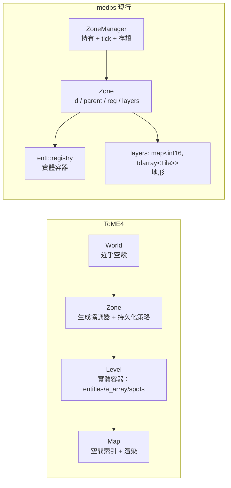

# ToME4 架構研讀 → medps 重寫建議報告

最後更新：2026-07-22（gcore 大重構之後：ZoneKey/GlobalManager/ZoneStore/ZoneMeta/WorldConfig/AreaTerrain/Blocking 已刪，現行核心為 `Zone{id, parent, reg, layers}` + `ZoneManager`）。

## 0. 方法與可信度聲明

研讀對象是 `C:\code\mine\modding_tome4` 的語料，**可信度不同，引用時已分級**：

| 語料層 | 性質 | 可信度 |
|---|---|---|
| `derived/tome4-modkit/knowledge/` | 每條在 ToME 1.7.6 原始碼複驗過、附行號 | 高（真相層） |
| `analysis/t-engine/architecture/` | 二手分析索引；真相層 README 稱其「只是索引」、可信度次於 knowledge | 中（本報告主要結構性事實來源） |
| `analysis/t-engine/tutorial/` | 教程層，部分主題（如 persistent 語意）比 architecture 層更細 | 中 |
| medps 自家 `docs/work/` | 2026-07-19 版，**早於這輪重構**，多數段落已與程式碼脫節 | 僅作「舊意圖」參考 |

該 repo 的引擎原始碼層（`projects/t-engine4/`）**未還原在磁碟上**，因此凡本報告寫「需回原始碼確認」，前置條件是先還原該目錄；還原前的務實替代是：自行定義語意並在設計文檔記錄為「medps 自定」而非「ToME 語意」。

本報告經過三路對抗性覆核（ToME4 事實 / medps 程式碼一致性 / 對研讀摘要的完整性），已修正覆核抓出的問題；殘餘存疑處集中在 §5。

## 1. 兩邊的世界結構對照

對映關係：medps 的 `Zone::reg` ≈ ToME 的 Level（實體容器），`Zone::layers` ≈ Map 的地形部分，`ZoneManager` ≈ Zone.lua 的管理職責＋World 的持有職責。**medps 沒有對應物的是 Map 的另一半——空間索引（格→實體反查）**，這是後面多條建議的根源。

兩個直接背書現行設計的事實：

- **「大地圖也只是一個 zone」**：ToME 的世界大地圖（wilderness）不是特殊系統，就是一個 `persistent="zone"` + Static 生成器的普通 zone（`M/data/zones/wilderness/zone.lua:20-39`，真相層）。約 89 個 zone——世界大地圖也是其中之一——共用同一個 Zone 抽象。medps「一切皆 zone」的路線是對的。
- **World 層刻意做薄**：World.lua 只有 `init()`/`run()` 掛點，玩法全在 Zone/Level。medps 的 root zone（id=0）應保持同樣紀律：只放真正跨 zone 的實體，抵抗把全局邏輯堆進去的誘惑。

## 2. 建議清單

每條標註：優先級（P0=下一步就該處理的設計債 / P1=近期 / P2=用到再說）、對應的 medps 現況。

### A. 位置模型（P0）——「actor 在哪個垂直層」目前無法表達

ToME 的 actor 位置語意實際上是 **(Level, x, y)**——Level 物件本身就是第三維；由 Level 的容器結構（`entities`/`e_array`）可推斷換層即在兩個 Level 容器間搬移實體（推論，語料未直述搬移機制）。medps 把垂直層收進同一個 Zone（`layers` 的 key 是 z）之後，`Position{x,y}`（[position.h](../../../projects/medp/src/gcore/components/position.h)）就缺了一維，跨層的阻擋/視線/移動判定都無從做起。

三個選項（本報告推薦 ①）：

| 選項 | 做法 | 代價 |
|---|---|---|
| ① Position 加 z 欄位 | `Position{x, y, z}`，z 對應 `layers` 的 key | 最小改動；空間查詢多比一欄 |
| ② Layer component | 另掛 `Layer{int16_t z}`，可用 EnTT group 加速同層查詢 | 兩個 component 要保持一致 |
| ③ 一層一 registry | 回到舊設計「不同 z 不同 zone」 | 推翻本輪的 layers 決定，跨層互動更難 |

推薦 ① 的理由：本輪已決策 z 不進 zone id（口頭拍板，記錄於此；[zone.h](../../../projects/medp/src/gcore/zone/zone.h) 註解亦標記 id 座標語意待重新設計），那 z 就是純座標，跟 x/y 同性質；等實測發現「按層遍歷」是熱路徑再升級到 ②。

### B. 空間索引（P1）——按格查實體目前只能全 registry 掃

ToME 的 Level/Map 職責分離：Level 管「誰在這層」（`entities` uid 查找 + `e_array` 行動順序），Map 管「誰在哪格」——稀疏 `[x+y*w]`，**每格的值不是單一 entity，而是「分類槽→entity」的小表**（TERRAIN=1 / TRAP=50 / ACTOR=100 / PROJECTILE=500 / OBJECT=1000 / TRIGGER=10000），同格可同時容納地形、陷阱、角色、物品。medps 有 Level 那半（registry）沒 Map 那半：回答「(x,y) 有沒有 actor」要 `view<Position>` 全掃。

建議：等第一個需要它的系統（碰撞、FOV）出現時，給 Zone 加 per-layer 的格→實體反查表，且結構第一天就做成「分類→entity」的多值容器——4X 必然出現 actor+物品+陷阱同格，單值表會返工。分類用 `enum class`、與序列化數值解耦（ToME 的裸魔術數字滲入所有呼叫點，是反面教材）。維護學 ToME 懶更新（實體移動時寫入，不每 tick 重建）。

不必急著做，但設計移動系統時要預留「位置變更必經一個函式」的口子——ToME 的 Actor 禁止直接設 x/y、必須走 `move()`（合理推測正是為了讓索引維護有單一入口，語料未明述動機）。這對 medps 是具體警訊：~~現行 [movement.h](../../../projects/medp/src/gcore/systems/movement.h) 直接 `p.x += v.dx` 改 Position，將來有空間索引後這條路必須收口~~ **已收口（2026-07-22）：位置變更統一走 `systems::move_by`（movement.h:12），tile flag 檢查與空間索引維護將來掛這裡**。

### C. 阻擋模型劃界（P1）——重構刪掉了 Blocking，模型只剩一半

ToME 走「一切皆實體」：地形格（Grid）也是實體，阻擋判定 = `checkAllEntities(x,y,"block_move")` 問遍格內所有實體。極靈活（門、可破壞牆、大型生物都自然表達），但每步移動都是多實體查詢。medps 的 `Tile{terrain, flags}` + `TILE_WALKABLE`（[tile.h](../../../projects/medp/src/gcore/zone/tile.h)）是反向選擇：快而死板。

建議維持混合模型並**明確劃界**：

- 靜態地形通行性 → Tile flags（現狀，保持）
- 動態阻擋源（門、召喚牆、站在格上的大型單位）→ 重建 ECS component（舊 `Blocking{blocks_move, blocks_sight}` 這輪被刪了，這個概念遲早要回來）
- 移動判定 = tile flag **AND** 空間索引查詢（B 做好之後）

反面教訓：不要把動態阻擋壓進 Tile flags——會產生「門開了誰負責還原 flag」的狀態同步難題。

### D. Zone 生命週期策略（P0）——ToME 的 persistent + decay + LRU 是現成答案骨架

medps 的 `ZoneManager` 有 load/unload/save_all 原語（[zone_manager.h](../../../projects/medp/src/gcore/zone/zone_manager.h)），但「**何時**載、**何時**卸」完全空白。ToME 的做法是把策略聲明在 zone 資料上、機制放引擎：

- `persistent`——每個 zone 自己聲明生命週期。⚠ 語料兩處說法**不一致**：architecture 層說三態 `"zone" | "level" | false`（engine_detail/3-世界結構.md），tutorial 層說**四態**且更細（tutorial/10-base-camp-basic/core-concepts.md）：`false`=離開即重生成、`"memory"`=存 `game.memory_levels`（存檔後消失）、`"zone"`=整 zone 以 `.teaz` 檔存磁碟、`true`=每層獨立存檔；機制為 leaveLevel 寫 memory_levels、`Zone:save()` 寫磁碟、getLevel 優先從 memory_levels 取。設計 medps 的 persistence 枚舉時以較細的四態版為藍本，或回原始碼裁決（前置見 §0）。
- `decay = {min, max}`——離開多久（遊戲 tick）後可回收。
- `enableLastPersistZones(max)`——LRU：最近造訪的 N 個 zone 留在記憶體。

建議：Zone struct 加 persistence 枚舉 + ZoneManager 加 LRU 卸載，策略是 zone 的資料、不寫死在 manager。對 4X 尺度（舊設計估算：Region ≤4 萬、Area ≤900 萬）這不是優化而是生存必需——「絕不全載、記憶體正比於已載入數」的舊紅線仍然成立。

殘餘未知：decay 與 persistent 的互動、LRU 逐出時機與逐出時是否寫盤，語料未載（見 §5）。

### E. 存檔（P0 兩條 + P1/P2 若干）

現行鏈路：`zone_io`（[zone_io.h](../../../projects/medp/src/gcore/serialize/zone_io.h)：id/parent/layers 走 cereal，reg 走 snapshot）→ `registry_io` → `entt_cereal_archive`。ToME 對照出的缺口：

1. **（P0）檔頭加版本欄位**。ToME 存檔帶 `description.lua`（模組/版本/addon 清單與可讀取旗標；如何用它判定可讀性，語料未載細節）。medps 正在重寫、格式月月變（這輪就變了三次：tdarray sx/sy、Tile 寬度、layers 容器），而現行檔案格式不自帶 schema、程式也未用 cereal 的版本機制（`CEREAL_CLASS_VERSION` 存在但我們沒用）。在 `zone_io::save` 開頭寫一個 `uint32 format_version`，讀時比對，成本近乎零，現在就該加。
2. **（P0）測試基準已斷 + orphans 語意需重新驗證**。現行測試套件（projects/tests/src/main.cpp）仍 include 這輪已刪的 zone_key.h / zone_meta.h / area_terrain.h / blocking.h / global_manager.h，並呼叫舊簽章 `zone_io::save(registry, stream)`——**整套 16 項測試目前不可編譯，AGENTS.md 的「16 項全綠」基準已失效**。舊套件其實已有 round-trip 與 orphans 機制驗證（serialize_roundtrip、serialize_orphans_removed），重寫測試套件時應保留並強化這兩類。orphans 的新風險點：ZoneMeta placeholder 已刪，純地圖無實體的 zone 是安全的（身分在 struct 上），但 [registry_io.h:30](../../../projects/medp/src/gcore/serialize/registry_io.h) 的 `loader.orphans()` 仍會讓「entity 只帶未登記 component」在讀檔時整個消失——這個坑要用「存後即讀回比對 entity 數」的測試升級成機制驗證。
3. **（P1）兩階段載入**。ToME 先反序列化所有物件、重設 metatable，**最後**才統一跑 `:loaded()`，保證相互引用完整才初始化。medps 對應：component 的反序列化不做依賴其他 entity 的初始化；ZoneManager 讀檔流程預留 post-load pass 的位置。
4. **（P2）背景存檔**。ToME 用 coroutine 分批（注意：語料明確說是協程，**不是**執行緒）達到不卡頓。medps 的「一 zone 一檔」天然支援按 zone 分批；將來需要時，「先 snapshot 到記憶體、再丟工作執行緒寫盤」比邊玩邊序列化安全。
5. **（維持）AllComponents 白名單**優於 ToME 的 `_no_save_fields` 黑名單。現行機制不動，鐵律（新 component 必登記）延續。
6. **（避開）**「行為進存檔」：ToME 的 `change_level_check` 函式會被序列化進存檔、因此不可有 upvalue——這是深坑。medps「存檔只有資料、行為在 system」的路線正確，堅持住，抵抗任何可序列化 callback 的誘惑。正面解法見 §2-H-8 的定義/實體化分離。

### F. 定址與跨 zone 引用（P0 設計題，實作可後置）

zone id 現在是裸 uint64、z 不進 id（本輪口頭拍板）。舊 ZoneKey 位元打包被刪時，同時失去了三樣東西，重新設計時要**逐一決定補齊還是放棄**：

| 舊方案買到的 | 現況 | ToME 給的參考 |
|---|---|---|
| key → 磁碟路徑可推導 | ZoneManager::path 用裸 id 的 hex，仍可推 | ToME 用字串短名當檔名，`+` 前綴帶命名空間 |
| key 自帶層級/座標語意 | 已失去（parent 改顯式欄位） | ToME 的 zone 定址就是字串短名，無座標語意——**它活得很好** |
| 免全域索引 | ZoneManager 的 map 就是索引 | ToME 的 zone 以目錄顯式存在、按短名推導路徑，無全域註冊清單 |

此外兩個 ToME 用血換來的教訓，直接關聯 medps 懸案：

- **跨 zone 實體引用**：`entt::entity` 是 per-registry 的，root zone 的全局角色（陣營、神祇）要指到某 zone 內的實體，現在無法表達。ToME 的做法是全域 uid + 弱引用（查不到就當死亡，容忍失效而非強行保證有效）。medps 若需要，對應物是：自建穩定 uid（uint64）+ 每 zone 的 uid→entity 映射 + 「解引用可失敗」的 API 形狀。
- **返回座標不能是全域一對**：ToME 玩家的 `wild_x/wild_y` 全域唯一（`Game.lua:1238-1248`），第二張大地圖一出現就壞掉（回錯座標、跳海、越界崩潰），原版沒踩到只因為只有一張大地圖。medps 做 zone 切換時，「玩家在每個 parent zone 的返回位置」必須是 **per-zone 記錄**，不是 player 身上的單一欄位。
- **傳送是 tile/entity 上的資料**：ToME 的 `change_zone`（目的地短名）+ `change_level`（層號）掛在 grid 上，回大地圖也是同一機制（樓梯 grid 指向大地圖）。medps 的 zone 傳送應同樣做成資料（Tile flag 或 component），不硬編在流程裡。

### G. 排程（P1）——能量制值得低成本引入

ToME 的核心排程只有一條公式：`energy.value += energy_per_tick * energy.mod * global_speed`，滿 `energy_to_act`（1000）就 `act()`。回合制（GameTurnBased）只是這套加一個 `paused` 旗標，**全部 54 行**。天然支援：速度差（mod）、全局時間縮放（global_speed）、以及 medps 特別需要的——**不同 zone 用不同 `energy_per_tick` 實現「非活躍 zone 低頻模擬」**。

對 medps：一個 `Energy{value, mod}` component + 一個 per-zone system 就能起步，與現行 `ZoneManager::tick()`（[zone_manager.cpp:74](../../../projects/medp/src/gcore/zone/zone_manager.cpp)）完全相容。舊設計「World 純回合 / Region WeGo / Area 即時」的三種時間模型，用 per-zone 的能量參數差異就能統一表達，不需要三套迴圈。

行動順序警訊：ToME 用 `e_array` 維護回合順序、`last_iteration` 處理迭代中移除。EnTT view 迭代中 destroy 當前實體是安全的，但「跨實體的行動順序」EnTT 不管——需要確定性順序時（回合制戰鬥）得自己維護序列。

### H. 生成管線（P2 實作，P1 先定介面形狀）

medps 地圖生成完全空白。ToME 的管線形狀值得整套參考：

1. **四類 generator 拆開**（map/actor/object/trap 各自獨立）——對應 medps 天然分工：map generator 寫 `Zone::layers`，actor/object generator 寫 `Zone::reg`。
2. **宣告式綁定**：zone 定義用 `{class="...", 參數...}` 指定生成器，換演算法只改資料。medps 目前沒有「zone 藍圖/定義」概念——這是接 Ruleset（見 §4）時該一起設計的。
3. **中間表示 + 草稿 commit**：ToME 部分生成器先在抽象 tilemap（字元格網）上跑演算法，最後才映射成實體。medps 版本：生成在 `tdarray` 草稿上做，連通性驗證通過才 commit 進 Zone——順便解決「生成失敗重試不污染正式資料」。
4. **連通性驗證是管線內建步驟**：A* 驗證入口可達出口，失敗丟棄整張重來（上限 50 次）。真相層有個具體慘案：Static 生成的出口未定義時**預設落在地圖正中心**（`Static.lua:520-522`），中心被牆圍住 → 重試 50 次 → changeLevel **靜默失敗**、玩家留在原地。教訓兩條：生成失敗必須是一級回傳值（不是 log 一行了事）；隱式預設（出口=中心）是坑源，要求顯式宣告。連通性的建構面：**MST 保底連通 + `fattenRandom`/`fattenShorter` 加環路**的兩段式介面值得照抄——4X 的道路、河谷連通同樣適用。
5. **spots**：生成器除了地形還輸出語意化生成點（出口、boss 房、寶藏位），後續放置階段消費。介面上第一天就留這個欄位。
6. **overlay 語意**：ToME 的子生成器貼圖時「nil 格跳過、只貼有東西的格子」，多來源共編一張地圖互不衝突。medps 若做模組疊加，Tile 層面預留「未定義」哨兵值。
7. **非同步介面 + 尺度分家**：ToME 的 WFC 生成器可獨立非同步跑、上層 `waitAll` 平行等待多實例——重演算法放 C++ 核心、參數與樣本放資料層。medps 將來按需背景生成多個 zone，介面第一天就以「可非同步 + 可平行等待」設計比同步阻塞好。另外不同尺度配不同演算法家族：world 層（200²）用 heightmap/noise，area 層（250²）用 Cavern/BSP/Forest——正是 generator 可插拔架構的用武之地。
8. **定義/實體化分離（resolver 的教訓）**：ToME 的實體定義可含延遲亂數規則（`resolvers.rngrange(1,5)` 只是標記 table），生成期才 `resolve()` 展開，並以 `current_level` 等情境變數計算（越深越強）。對 medps 的關鍵啟示：**生成規則屬「定義層」資料（Ruleset 側），存檔只存展開後的實體化結果**——這一刀切下去，「cereal 怎麼存 lambda/規則」的難題整個消失，也正是 §2-E-6「行為不進存檔」的正面解法。另注意 ToME 用 `__resolve_instant`/`__resolve_last` 標記展開順位——medps 的生成規則管線需要顯式的階段順序，不能仰賴定義順序。
9. **ToME 幫不上的部分**：它全部是單層 2D 生成，**多垂直層生成（跨層樓梯/坑洞連通）是 medps 自己的功課**，generator 介面第一天就要以「layer 為生成單位 + 跨層連通驗證」設計。

### I. 方法論（貫穿性）

真相層 README 的核心教訓：**這個引擎很愛靜默失敗**——寫錯了不拋錯，只是安靜地什麼都不發生（`grids.lua` 缺席→整張地圖靜默空白；`wda.script` 指錯檔→玩家走第一步才炸）。該 repo 因此建立三層驗證（靜態檢查→無頭載入→實機操作）。

medps 的對應：

- **缺席行為要分級且文件化**：必填缺席 → fail-fast 並報 zone id；可選缺席 → 文件化的預設值。絕不允許「缺了就靜默空白」。medps 現行最大的同類風險就是 AllComponents 漏登記（悄悄漏存），E-2 的 round-trip 驗證是對症藥。
- **三層驗證的 medps 版**：compile-time（type_list / static_assert）→ 單元測試 → 序列化 round-trip + 「入口走得到出口」這類語意性整合測試。「Level unconnected 只有實機才現形」說明：zone 能建出來 ≠ zone 是對的。
- **避開包裹式巨型旗標**：ToME 的 `wilderness=true` 一個布林同時改時間流速、FOV 管線、技能鎖、掉落語意，不能只挑一部分用。medps 的 per-zone system 註冊機制天生能做對：把這類差異做成可獨立掛/不掛的 system 組合。
- **渲染不進資料層**：ToME 的 Map.lua 一半欄位是渲染態，是資料/渲染耦合的反面教材。medps 後端庫保持純資料、渲染歸 Godot 前端——現行設計已正確，維持。

## 3. 舊設計意圖：推翻 vs 存續

這輪重構後，`docs/work/` 的四份文檔**全部**不同程度過時（含 lifecycle.md——其兩-scope 原則存續，但文中 GlobalManager/load_root/WorldConfig/ZoneKey 推導等段落引用的都是已刪之物）。逐項清點：

| 舊意圖 | 狀態 | 備註 |
|---|---|---|
| ZoneKey 位元打包、parent 整除推導 | **已推翻** | parent 改顯式欄位；失去的三樣東西見 §2-F |
| 不同 z = 不同 zone | **已推翻** | z 收進 `Zone::layers`；連帶產生 §2-A 的 Position 缺口 |
| 地圖=component 走 snapshot | **已推翻** | layers 掛 struct，`zone_io` 另行序列化（已實作） |
| ZoneMeta placeholder 防 orphans 清空 | **已推翻** | 身分改由 struct 承載；殘餘風險見 §2-E-2 |
| 「底層型別不叫 Zone」命名戒律 | **已推翻** | 現行就叫 `struct Zone`，讀舊文檔時注意措辭對映 |
| WorldConfig root singleton / world_dim 凍結 | **已推翻** | 隨 ZoneKey 刪除；新定址方案可自由重新決定 |
| 16 項測試全綠基準 | **已失效** | 測試套件仍對應舊架構，目前不可編譯；見 §2-E-2 與 §4 step 0 |
| 絕不全載、記憶體正比於已載入數 | **存續** | §2-D 的硬約束 |
| create/load/unload/save_all API 形狀 | **存續** | ZoneManager 與舊 GlobalManager 同形（唯 load_root 已無對應物） |
| Ruleset 兩-scope 生命週期原則 | **存續（文本過時）** | process-resident / ctx 注入 / 規則檔吃 OS 路徑等方向有效；lifecycle.md 內文的 GlobalManager、load_root()、WorldConfig、ZoneKey 段落需對映到新 API 讀。`Tile::terrain` 作為 def id 索引 Ruleset 的語意仍適用 |
| AllComponents 單一來源 + entt_id_t 可攜互轉 | **存續** | 鐵律延續 |
| 三層尺度數字（200²/15²/250²）與三種時間模型 | **存續** | 唯一寫下遊戲設計意圖的資料；§2-G 的能量制可統一表達三種時間模型 |
| 舊開啟事項四條（跨層連通/跨 zone 身份/世界邊緣/分派 tick） | **全部仍懸置** | 分別對應本報告 §2-H-9 / §2-F / （未涉及） / §2-G |

## 4. 建議落地順序

0. **前置（P0）**：重寫測試套件對齊新架構、重定綠色基準——不做這步，後面所有「behavior-preserving」都無從驗證（AGENTS.md 鐵律的前提）。保留舊套件的 serialize_roundtrip / orphans 兩類測試精神。
1. **馬上（P0，小成本）**：存檔版本欄位（§2-E-1）；Position 補 z（§2-A）；round-trip + entity 數比對測試（§2-E-2，併入 step 0 的新套件）。
2. **下一個設計回合（P0，設計題）**：zone 定址語意（§2-F）——決定 id 形態、跨 zone 引用要不要 uid、返回座標的 per-zone 記錄；生命週期策略（§2-D）——persistence 枚舉（以四態版為藍本）+ LRU。這兩題互相牽動，建議一起談。
3. **有第一個玩法系統時（P1）**：能量制排程（§2-G）；空間索引 + move() 收口（§2-B）；Blocking 重建（§2-C）；ZoneManager 讀檔流程預留 post-load pass（§2-E-3）；**先定生成器介面形狀**（§2-H：spots 欄位、以 layer 為生成單位、跨層連通驗證、可非同步）。
4. **開始做內容時（P2）**：生成管線實作（§2-H）；定義/實體化分離與 Ruleset 接線（§2-H-8 + lifecycle.md 原則）；背景存檔（§2-E-4，按需）。

## 5. 語料存疑處（引用前需複驗）

- `persistent` 的枚舉值兩處文件**衝突**：architecture 層三態（`"zone"|"level"|false`）vs tutorial 層四態（`false|"memory"|"zone"|true`，且「逐層存檔」對應 `true` 而非 `"level"`）。本報告 §2-D 採較細的四態版；裁決需回原始碼（前置見 §0）。
- `decay` 與 persistent 的互動、LRU `enableLastPersistZones` 的逐出時機/是否寫盤：語料未載。
- 「resolver 展開結果進存檔、規則不進存檔」是**推論**（由「resolver 依附定義、生成期 resolve」推得），語料無直接證據；「已生成但含未 resolve 欄位的實體被存檔」的邊角情況語料全無描述。
- Cavern 演算法兩份文件說法不一（Perlin+flood-fill vs 細胞自動機）；GOL 代數不一（3 代 vs 多代）；生成器清單可能不完整（範例用的 `Roomer` 不在清單上）。
- Level 的欄位（`e_array`/`entities`/`spots`/`sublevels`）僅單一文件來源，無交叉驗證。
- SavefilePipe 是 coroutine 分批，語料**無**「背景執行緒」的證據——別把 ToME 想得比實際多執行緒。
- `docs/references/` 底下有一篇 zone streaming 架構教學**本次未讀**，與 §2-D 直接相關，值得補讀。
- analysis 層的 zone 統計（89 個、Infinite Dungeon `max_level=10^9` 等）無行號複驗，採信降一級。

## 6. 一句話總結

ToME4 用一個不起眼的 Zone 抽象撐起了約 89 個 zone（世界大地圖也是其中之一），證明 medps「一切皆 zone」的骨架是對的；它真正值得抄的不是資料結構（Lua 的實體湯 medps 不該學），而是**策略聲明在資料上（persistent/generator）、失敗是一級公民（連通性驗證、fail-fast）、行為不進存檔（定義層規則生成期展開、存檔只存結果）**這三條紀律——以及它用一個全域 `wild_x/wild_y` 欄位和一堆靜默失敗換來的反面教材。
