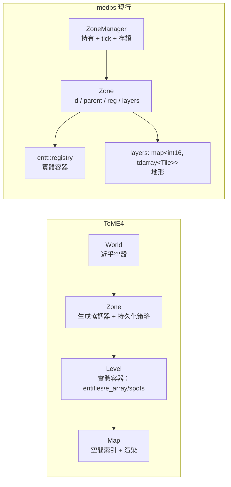

# ToME4 架構研讀 → medps 重寫建議報告 —— §0～§1 方法與背景

> 本檔是 [tome4_recommendations.md](tome4_recommendations.md) 的拆分子檔（§0 方法與可信度聲明、§1 兩邊的世界結構對照）。回索引見母檔；下一節「§2 建議清單 A-D」見 [tome4_recommendations_p0_core.md](tome4_recommendations_p0_core.md)。

最後更新：2026-07-22（gcore 大重構之後：ZoneKey/GlobalManager/ZoneStore/ZoneMeta/WorldConfig/AreaTerrain/Blocking 已刪，現行核心為 `Zone{id, parent, reg, layers}` + `ZoneManager`）。

## 0. 方法與可信度聲明

研讀對象是 `C:\code\mine\modding_tome4` 的語料，**可信度不同，引用時已分級**：

| 語料層 | 性質 | 可信度 |
|---|---|---|
| `derived/tome4-modkit/knowledge/` | 每條在 ToME 1.7.6 原始碼複驗過、附行號 | 高（真相層） |
| `analysis/t-engine/architecture/` | 二手分析索引；真相層 README 稱其「只是索引」、可信度次於 knowledge | 中（本報告主要結構性事實來源） |
| `analysis/t-engine/tutorial/` | 教程層，部分主題（如 persistent 語意）比 architecture 層更細 | 中 |
| medps 自家 `docs/work/` | 2026-07-19 版，**早於這輪重構**，多數段落已與程式碼脫節 | 僅作「舊意圖」參考 |

該 repo 的引擎原始碼層（`projects/t-engine4/`）**未還原在磁碟上**，因此凡本報告寫「需回原始碼確認」，前置條件是先還原該目錄；還原前的務實替代是：自行定義語意並在設計文檔記錄為「medps 自定」而非「ToME 語意」。

本報告經過三路對抗性覆核（ToME4 事實 / medps 程式碼一致性 / 對研讀摘要的完整性），已修正覆核抓出的問題；殘餘存疑處集中在 §5（見 [tome4_recommendations_status_summary.md](tome4_recommendations_status_summary.md)）。

## 1. 兩邊的世界結構對照

對映關係：medps 的 `Zone::reg` ≈ ToME 的 Level（實體容器），`Zone::layers` ≈ Map 的地形部分，`ZoneManager` ≈ Zone.lua 的管理職責＋World 的持有職責。**medps 沒有對應物的是 Map 的另一半——空間索引（格→實體反查）**，這是後面多條建議的根源。

兩個直接背書現行設計的事實：

- **「大地圖也只是一個 zone」**：ToME 的世界大地圖（wilderness）不是特殊系統，就是一個 `persistent="zone"` + Static 生成器的普通 zone（`M/data/zones/wilderness/zone.lua:20-39`，真相層）。約 89 個 zone——世界大地圖也是其中之一——共用同一個 Zone 抽象。medps「一切皆 zone」的路線是對的。
- **World 層刻意做薄**：World.lua 只有 `init()`/`run()` 掛點，玩法全在 Zone/Level。medps 的 root zone（id=0）應保持同樣紀律：只放真正跨 zone 的實體，抵抗把全局邏輯堆進去的誘惑。

---
下一節：[§2 建議清單 A-D（位置模型／空間索引／阻擋模型／生命週期策略）](tome4_recommendations_p0_core.md)　|　回索引：[tome4_recommendations.md](tome4_recommendations.md)
